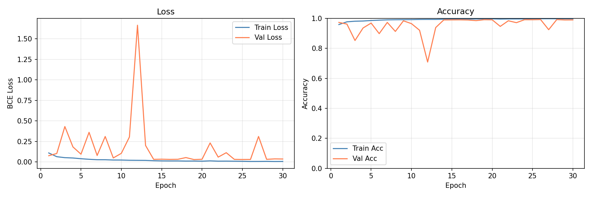

# Promoter Sequence Classifier API

A lightweight 1D CNN-based API for classifying DNA sequences as promoter or non-promoter using one-hot encoding. Built with PyTorch and FastAPI, it returns predictions with confidence scores from raw sequence input.

## Features

- **Fast Inference**: 1D Convolutional Neural Network optimized for DNA sequence classification
- **REST API**: Built with FastAPI for easy integration
- **Batch Processing**: Support for classifying multiple sequences in a single request
- **Confidence Scores**: Returns prediction probabilities along with binary classifications
- **Input Validation**: Validates DNA sequences (A, C, G, T only)
- **Docker Ready**: Containerized deployment option

## Model Details

- **Architecture**: 1D CNN with convolutional layers, max pooling, and fully connected layers
- **Input**: 600 bp DNA sequences (one-hot encoded)
- **Output**: Binary classification (promoter/non-promoter) with confidence scores
- **Training Data**: EPDnew human promoter sequences
- **Performance**: Trained to distinguish promoter regions from non-promoter DNA windows

## Training Curves



The model was trained for 30 epochs with early stopping based on validation loss. The training curves show the loss and accuracy progression over epochs.

## Installation

### Prerequisites

- Python 3.8+
- PyTorch 2.2+
- CUDA (optional, for GPU acceleration)

### Setup

1. Clone the repository:
```bash
git clone <repository-url>
cd promoter-sequence-classifier-api
```

2. Create a virtual environment:
```bash
python -m venv .venv
source .venv/bin/activate  # On Windows: .venv\Scripts\activate
```

3. Install dependencies:
```bash
pip install -r requirements.txt
```

4. Run the setup script (optional):
```bash
chmod +x setup.sh
./setup.sh
```

## Usage

### Running the API

Start the FastAPI server:

```bash
cd api
uvicorn main:app --host 0.0.0.0 --port 8000 --reload
```

The API will be available at `http://localhost:8000`

### API Endpoints

#### Health Check
- **GET** `/health`
- Returns the API status and model loading information

#### Single Sequence Classification
- **POST** `/classify`
- **Body**:
```json
{
  "sequence": "ATCGATCG..."
}
```
- **Response**:
```json
{
  "label": "promoter",
  "confidence": 0.85,
  "probability": 0.85,
  "length": 600,
  "time_ms": 12.34
}
```

#### Batch Classification
- **POST** `/batch_classify`
- **Body**:
```json
{
  "sequences": ["ATCG...", "GCTA..."]
}
```
- **Response**:
```json
{
  "total": 2,
  "results": [
    {
      "label": "promoter",
      "confidence": 0.85,
      "probability": 0.85,
      "length": 600
    },
    {
      "label": "non-promoter",
      "confidence": 0.92,
      "probability": 0.08,
      "length": 600
    }
  ],
  "time_ms": 15.67
}
```

### API Documentation

Visit `http://localhost:8000/docs` for interactive API documentation powered by Swagger UI.

## Training the Model

To train the model from scratch:

1. Prepare your data in the `data/processed/` directory:
   - `X_train.npy`, `y_train.npy` (training data)
   - `X_val.npy`, `y_val.npy` (validation data)
   - `X_test.npy`, `y_test.npy` (test data)

2. Run the training script:
```bash
cd src
python train.py
```

The trained model will be saved as `models/cnn_promoter.pt` and training curves as `models/training_curves.png`.

## Docker Deployment

Build and run with Docker:

```bash
docker build -t promoter-classifier .
docker run -p 8000:8000 promoter-classifier
```

## Project Structure

```
promoter-sequence-classifier-api/
├── api/                    # FastAPI application
│   ├── main.py            # API endpoints
│   ├── inference.py       # Model inference logic
│   └── __init__.py
├── src/                    # Training and model code
│   ├── model.py           # CNN architecture
│   ├── train.py           # Training script
│   ├── dataset.py         # Data loading
│   ├── preprocess.py      # Data preprocessing
│   ├── utils.py           # Utilities
│   └── __init__.py
├── data/                   # Data directory
│   ├── raw/              # Raw data
│   └── processed/        # Processed numpy arrays
├── models/                # Trained models and plots
│   ├── cnn_promoter.pt   # Trained model weights
│   └── training_curves.png # Training visualization
├── notebooks/             # Jupyter notebooks
├── requirements.txt       # Python dependencies
├── setup.sh              # Setup script
├── Dockerfile            # Docker configuration
└── README.md             # This file
```

## Dependencies

- torch==2.2.2
- numpy==1.26.4
- biopython==1.83
- scikit-learn==1.4.2
- matplotlib==3.8.4
- fastapi==0.111.0
- uvicorn==0.29.0
- pydantic==2.7.1
- requests==2.31.0
- jupyter==1.0.0

If you use this model in your research, please cite:

```
[Add citation information]
```
